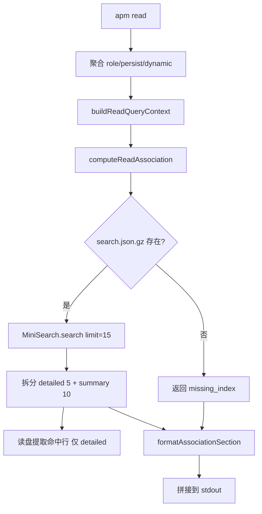

# apm read 联想区 技术规格（SPEC）

依据 PRD：`docs/Iterations/apm-read-association-area/prd.md`。

## 设计目标

- 在 **`apm read`** 输出中，于 **# 动态记忆** 之后追加 **# 联想区**（按 PRD 条件显示或省略）。
- 以 **role + persist + dynamic** 合并正文为查询上下文，对 **`.apm/kb/` 下除 `index/` 外全部 `.md`** 做 BM25+ 检索，分层展示详细区（≤5）与简略区（≤10）。
- **扩展索引范围**（相对现状）：`rebuildKbIndex` / `searchKb` 从仅 `kb/docs` 扩至整个 `kb/`（排除 `index/`），与 PRD AC-9 一致。
- **复用** 现有 `kbTokenize`、MiniSearch、gzip 索引管线；新增联想编排、停用词过滤、格式化与测试，**不** 做 `--json`。

## 现状约束（代码事实）

| 区域 | 当前实现 | 本需求影响 |
|------|-----------|------------|
| `apm read` | `src/cli/commands/read.ts` 仅循环 `SECTION_MAP` 输出三段记忆 | 需在同样 action 末尾调用联想服务并拼接输出 |
| 索引扫描 | `walkKbMdRel(p.kbDocs)` 只遍历 `kb/docs`（`kb-index-service.ts:75-88`） | **必须改为** 从 `kb/` 根递归，跳过 `index/` 目录 |
| 文档 path 主键 | 索引 `idField: "path"` 为相对 **`kb/docs`** 的路径（如 `alpha-topic.md`） | 改为相对 **`kb/`** 的路径（如 `docs/alpha-topic.md`、`dynamic/detail.md`、`archive/xxx.md`）；**破坏性**：旧 `search.json.gz` 需 `kb index rebuild` |
| `searchKb` | `limit` 默认 5；缺索引 **throw**（`kb-index-service.ts:115-117`） | 联想需 `limit=15`；缺索引 **不 throw**，由 read 层展示提示 |
| `kb write` | 仅写入 `kb/docs`（`kb.ts` + `resolveKbDocPath`） | 行为不变；`dynamic archive` 写入 `kb/archive/` 后需用户/测试 **手动 rebuild** 才进索引 |
| 分词 | `kbTokenize` + `processTerm: toLowerCase`（`kb-index-service.ts:18-58`） | 联想关键词与索引共用；另增 **停用词/噪声过滤**（PRD AC-12） |
| 测试 | `tests/cli.spec.ts` T6/T7/T8 覆盖 kb search 与 read | 需更新路径断言并新增联想用例 |

**MiniSearch 检索结果**（v7.2.0）：除 `score` 外含 `terms: string[]` 与 `match: Record<string, string[]>`，可用于「查询词 ∩ 文档命中词」关键词展示，无需二次猜词。

## 总体方案



### 1. 索引范围扩展（`kb-index-service.ts`）

- 新增 `apmPaths` 字段 **`kbRoot`** = `join(.apm, "kb")`（或在服务内 `join(p.root, "kb")`，推荐集中进 `paths.ts`）。
- 将 `walkKbMdRel(kbDocs)` 重命名为 **`walkKbMarkdownUnderKbRoot(kbRoot)`**：
  - 递归 `kbRoot` 下所有 `.md`；
  - **跳过** 名为 `index` 的目录（仅跳过该段，不跳过名为 index 的文件）；
  - 返回路径为 **相对 `kbRoot` 的 posix 路径**（`docs/a.md`、`dynamic/detail.md`、`archive/dynamic-....md`）。
- `rebuildKbIndex`：`abs = join(kbRoot, rel)`，`ms.add({ path: rel, title, body })` 逻辑不变。
- 新增 **`resolveKbIndexedPath(kbRoot, rel)`**：校验 `rel` 无 `..`、落在 `kbRoot` 内，用于读盘。

### 2. 检索 API 分层（`kb-index-service.ts`）

| 函数 | 职责 |
|------|------|
| `loadKbMiniSearch(cwd)` | 读 gzip → `MiniSearch.loadJSON`；缺文件返回 `null` |
| `searchKbIndex(ms, query, limit, options?)` | 封装 `ms.search(query, { fuzzy: 0.2, prefix: true })`，映射为 **`KbSearchHitEx`**：`path, title, score, terms, match` |
| `searchKb(cwd, query, limit)` | 保持现有 CLI 行为；内部调用上述函数；缺索引仍 **throw**（T7 不变） |

联想与 `kb search` 共用 `searchKbIndex`，仅 `limit` 不同（5 vs 15）。

### 3. 停用词 / 噪声过滤（新文件 `src/core/kb-stopwords.ts`）

导出 **`isKbNoiseToken(term: string): boolean`**，规则（确定性、可单测）：

- 长度 0 或纯空白；
- 匹配 **email** 正则（含 `@` 的 token）；
- 仅标点/符号（无字母数字与 CJK）；
- 内置英文停用表（小写比较）：`a`, `an`, `the`, `is`, `are`, `was`, `were`, `be`, `been`, `being`, `in`, `on`, `at`, `to`, `for`, `of`, `and`, `or`, `but`, `as`, `by`, `with`, `from`, `it`, `this`, `that`（与 PRD AC-12 对齐，后续可扩表不改接口）。

**关键词选取**（单条命中）：

1. `queryTerms = kbTokenize(queryContext).filter(t => !isKbNoiseToken(t))`
2. `hitTerms = new Set(result.terms.concat(Object.keys(result.match ?? {})))`
3. `keywords = queryTerms.filter(t => hitTerms.has(t))`，按 **在 queryTerms 中出现顺序** 去重保留；若为空则 fallback 为 `hitTerms` 中过滤噪声后的前 **5** 个（字典序，保证确定性）。
4. 首行展示：**空格分隔**（实现与测试固定为空格，不用逗号）。

### 4. 联想编排服务（新文件 `src/services/read-association-service.ts`）

**类型**

```ts
export type ReadAssociationLine = { lineNo: number; text: string };
export type ReadAssociationEntry = {
  path: string;       // 相对 kb/，posix
  matchPercent: number;
  keywords: string[];
  lines?: ReadAssociationLine[]; // 仅 detailed
};
export type ReadAssociationResult =
  | { status: "missing_index" }
  | { status: "empty_query" }
  | { status: "no_hits" }
  | {
      status: "ok";
      detailed: ReadAssociationEntry[];
      summary: ReadAssociationEntry[];
    };
```

**`buildReadQueryContext(cwd): string`**

- 依次 `readSectionContent(cwd, "role" | "persist" | "dynamicDetail")`（与 read 命令相同，已去 front matter）。
- `parts.join("\n\n")`；section 读失败 **跳过**（与 read 对单 section 的 warn 策略一致，不把损坏文件内容计入查询）。

**`computeReadAssociation(cwd): ReadAssociationResult`**

1. `query = buildReadQueryContext(cwd).trim()`；若为空 → `empty_query`。
2. `ms = loadKbMiniSearch(cwd)`；若 `null` → `missing_index`。
3. `raw = searchKbIndex(ms, query, 15)`；若 `raw.length === 0` → `no_hits`。
4. **匹配率**：`maxScore = max(raw[].score)`；若 `maxScore <= 0` 则全部 `0`，否则 `matchPercent = round(score / maxScore * 100)`（整数）。
5. **去重**：按 `path` 保留第一条（已按 score 降序）。
6. **分层**：
   - `detailed = unique.slice(0, 5)`，对每条调用 `collectHitLines(kbRoot, path, keywords, 3)`；
   - `summary = unique.slice(5, 15)`（最多 10 条），无 `lines`。
7. **`collectHitLines`**：读 **磁盘原始文件**（非 strip 后 body）；按行号 1-based；`trim()` 非空；行内包含任一 `keywords`（ASCII 用 `toLowerCase()` 子串；CJK 直接 `includes`）；取文件顺序前 3 行。

**`formatAssociationSection(result): string | null`**

| status | 输出 |
|--------|------|
| `missing_index` | `# 联想区\n\nKnowledge index missing. Run \`apm kb index rebuild\`.` |
| `empty_query` / `no_hits` | `null`（整段省略） |
| `ok` | 见下表 |

**文本格式（固定）**

```text
# 联想区

[100%] docs/foo.md keyword1 keyword2
12|line content here

[80%] archive/bar.md kwA

[65%] dynamic/detail.md kwB
```

- 区块标题：`# 联想区`（一级标题，与记忆三段一致）。
- 详细区每条：首行 + 0~3 行 `行号|正文`；条与条之间 **空一行**。
- 简略区：仅首行，条间 **空一行**；详细区与简略区之间也 **空一行**。
- 路径：**相对 `kb/`**，不带 `.apm/kb/` 前缀（AC-2 选定方案）。

### 5. `read.ts` 集成

```ts
// 现有 memory parts 输出后：
const assoc = computeReadAssociation(cwd);
const assocText = formatAssociationSection(assoc);
if (assocText) {
  if (parts.length > 0) parts.push(assocText);
  else parts.push(assocText); // 仅联想区时仍输出（边界：三段皆空但有 kb 命中）
}
```

- 联想区 **不** 影响现有 section 的 `console.error` warn 逻辑。
- **不** 新增 CLI 选项。

### 6. 与 `apm kb search` 的兼容性

- `searchKb` 返回的 `path` 将变为 `docs/...` 等形式；**T6 断言** 改为包含 `docs/alpha-topic.md` 或 `alpha-topic.md` 子串（推荐完整新路径）。
- CLI 行为、throw 语义、默认 `limit=5` **不变**。

## 最终项目结构

```
src/
  storage/
    paths.ts                      # + kbRoot
  core/
    kb-stopwords.ts               # 新增：isKbNoiseToken
  services/
    kb-index-service.ts           # 扩展扫描范围；检索 API 分层；KbSearchHitEx
    read-association-service.ts   # 新增：上下文、分层、格式化
  cli/commands/
    read.ts                       # 拼接联想区
tests/
  cli.spec.ts                     # 更新 T6 路径；新增 T-READ-ASSOC-*
```

## 变更点清单

| 路径 | 变更 | 说明 |
|------|------|------|
| `src/storage/paths.ts` | 修改 | `apmPaths` 增加 `kbRoot` |
| `src/services/kb-index-service.ts` | 修改 | 全 kb 扫描；`loadKbMiniSearch` / `searchKbIndex`；path 相对 kbRoot |
| `src/core/kb-stopwords.ts` | 新增 | 噪声 token 过滤 |
| `src/services/read-association-service.ts` | 新增 | 联想核心逻辑与格式化 |
| `src/cli/commands/read.ts` | 修改 | 调用联想服务 |
| `tests/cli.spec.ts` | 修改 | 回归 + 联想 AC 用例 |

**不改动**：`kb.ts` CLI 子命令签名、`sections-service.ts`、`config` schema、PRD 排除的 `--json`。

## 兼容性或迁移说明

- **索引 path 主键变更**：旧索引中 `path` 为 `foo.md` 时，重建后为 `docs/foo.md`；**必须** 在发布说明中写一句：升级后执行一次 `apm kb index rebuild`。
- **无自动迁移**：不读取旧 path 格式；缺重建时 search 可能 0 命中直至 rebuild。
- **`apm read` 输出**：仅新增可选区块，原三段格式不变（AC-15）。

## 详细实现步骤

1. **`paths.ts`**：增加 `kbRoot: join(root, "kb")`。
2. **`kb-stopwords.ts`**：实现 `isKbNoiseToken` + 单元级可测停用表。
3. **重构 `kb-index-service.ts`**：
   - 替换 walk 为 kbRoot 全量扫描（跳过 `index/`）；
   - 抽出 `loadKbMiniSearch`、`searchKbIndex`、`resolveKbIndexedPath`；
   - `searchKb` 改为薄封装。
4. **`read-association-service.ts`**：实现 `buildReadQueryContext`、`computeReadAssociation`、`formatAssociationSection`、`collectHitLines`、`pickKeywords`。
5. **`read.ts`**：在 `parts.join` 前合并联想文本；`assocText` 为 `null` 时不追加。
6. **测试**：见下表；本地 `npm test` 全绿。
7. **手工**：在含 `kb/archive`、`kb/dynamic` 夹具上 `read` 目视检查格式。

## 测试策略

### 测试用例

| ID | 对应 AC | 场景 | 断言要点 |
|----|---------|------|----------|
| T-READ-ASSOC-1 | AC-1 | init + 写 role/persist/dynamic + kb docs 含共有特征词 + rebuild + read | 输出顺序含 `# 角色`…`# 动态记忆`…`# 联想区`；联想首行匹配 `/\[\d+%\]/` |
| T-READ-ASSOC-2 | AC-3 | 写入 ≥8 篇含同一特征词的 md（`docs/a0.md`…），上下文含该词 | 联想区 `[\d+%]` 行数 **= 5**；匹配率非递增（降序） |
| T-READ-ASSOC-3 | AC-5 | 仅 2 篇可命中 | `[\d+%]` 行 **= 2**，无多余占位 |
| T-READ-ASSOC-4 | AC-6 | ≥20 篇可命中 | `[\d+%]` 行 **= 15**；路径互不重复（regex 提取 path 段校验） |
| T-READ-ASSOC-5 | AC-7 | 同 T-READ-ASSOC-4 | 第 6~15 条后无 `\d+\|` 行号模式（简略区无正文行） |
| T-READ-ASSOC-6 | AC-9 | 仅在 `kb/archive/only-here.md` 放特征词 `zzassoc_archive_only`，上下文含该词，docs 无该词 | read 输出含 `archive/only-here.md` |
| T-READ-ASSOC-7 | AC-10 | 两阶段：dynamic 含词 A、role 含词 B；各建 kb 文档仅被对应词命中 | 改 role 后 read，联想结果包含 B 对应路径 |
| T-READ-ASSOC-8 | AC-11 | 任意有命中夹具 | 所有 `%]` 前整数 ∈ [0,100]；至少一条 `[100%]` |
| T-READ-ASSOC-9 | AC-12 | 上下文仅含 `the a uniquekw` | 首行关键词不含单独 `the`/`a`；含 `uniquekw` |
| T-READ-ASSOC-10 | AC-13 | 删除 `search.json.gz` 后 read | `out` 仍含 `# 角色`（或已写 section）；含 `# 联想区` 与 `kb index rebuild`；进程 exit 0 |
| T-READ-ASSOC-11 | AC-14 | 有索引但上下文与 kb 无交集 | **不含** `# 联想区` |
| T-READ-ASSOC-12 | AC-4 | 1 篇 md 多行含关键词 | 该条下方 `行号\|` 行数 ≤3，且均非空 |
| — | AC-15 / 回归 | 原 T8、T-READ-ROBUST | 仍通过；T6 路径更新为 `docs/alpha-topic.md` |

**夹具辅助**：在测试内用 `kb write` + `writeFileSync`（archive/dynamic 路径）+ `kb index rebuild`；`config set` 放宽 role/persist/dynamic min/max。

### 测试实现提示

- 用 `runCli` 捕获 `out`；`[\d+%]` 计数可用 `out.match(/^\[\d+%\]/gm)`（需确认详细+简略首行均以此开头）。
- 特征词使用长随机前缀（如 `zzassoc_…`）避免与停用词冲突。

## 风险与回滚方案

| 风险 | 缓解 |
|------|------|
| 索引范围扩大后 rebuild 变慢 | 接受；常规 kb 规模下内存遍历可接受；不在此迭代做增量索引 |
| path 变更导致旧索引失效 | 文档 + 测试强制 rebuild；错误提示沿用 `kb index rebuild` |
| `archive`/`dynamic` 写入后未 rebuild 导致 read 联想不到 | PRD 已要求索引覆盖；可选后续：archive/import 后自动 rebuild（**本次不做**） |
| 中文关键词 fallback 到 hitTerms 字典序 | 与 PRD「命中词」一致；验收以 AC-9/10 为准 |
| read 与 kb search 的 fuzzy/prefix 误命中 | 与现 `searchKb` 保持一致，不在此迭代调参 |

**回滚**：`git revert` 涉及文件即可；无 schema 变更。用户侧重跑一次 `kb index rebuild`。

---

**文档路径：** `docs/Iterations/apm-read-association-area/spec.md`

请确认本 SPEC；确认后再进入编码实现。
